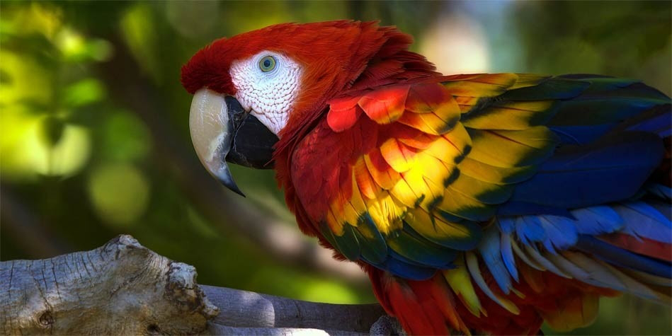
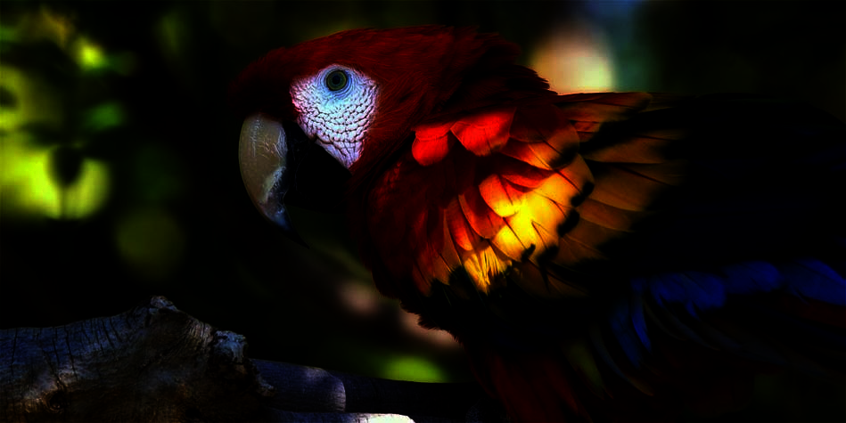

# Image Processing in Java
This application allows for simple processing of the .pcx files

## Features
* Arithmetic operation on an image using constants or another image
* Geometric operations on an image
* Modification of the histogram of a file
* morphologic operations
* examples of the linear and non linear filters

## Screenshots

## Technologies
* JDK 8u111

## TODO
* Fixing some of the features that are wrong by definition, but had to be done in such way "because prof. knows best"
* Or deleting them/rephrasing the options to specify the deviation